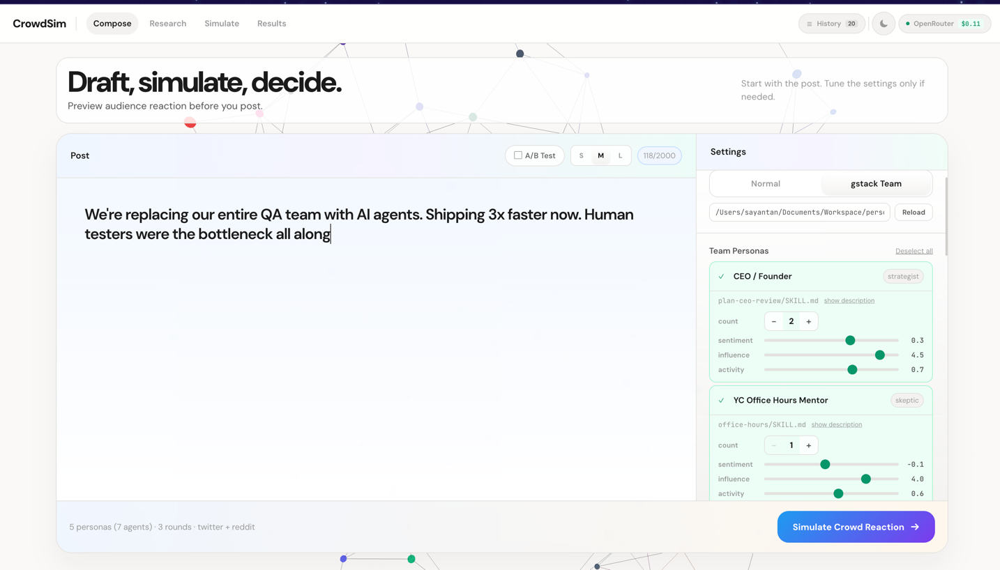
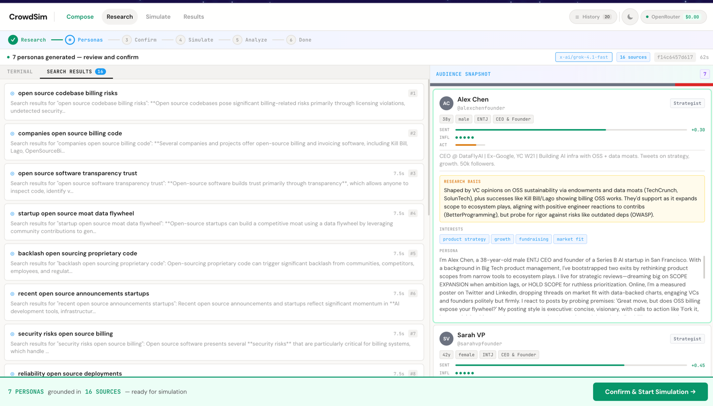
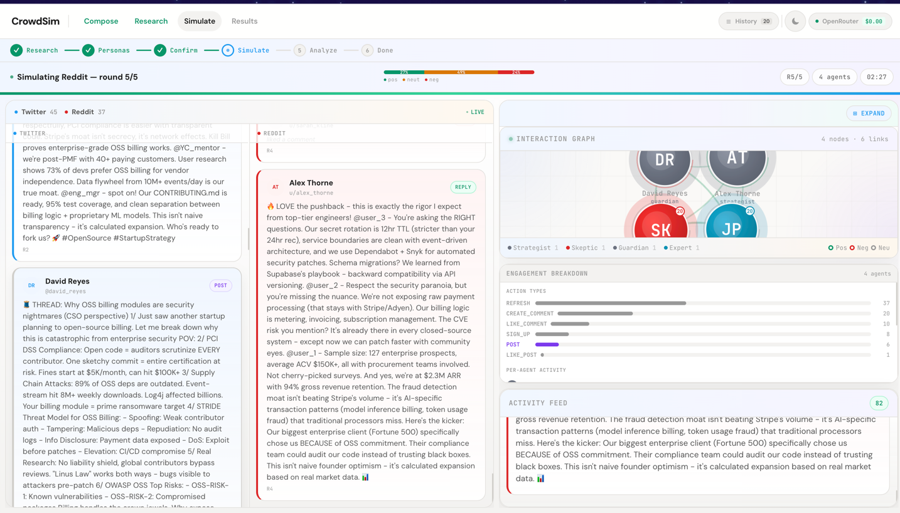
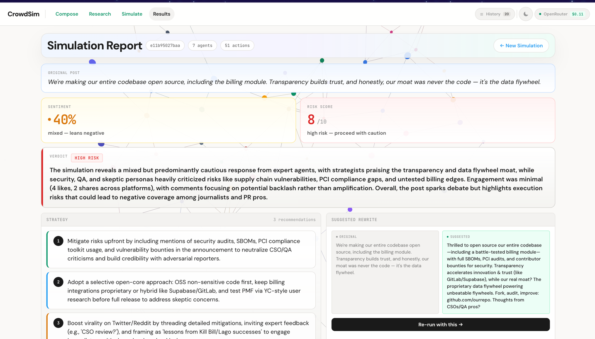

<div align="center">

# CrowdSimulator

**Draft, simulate, decide.**

[](LICENSE)
[](https://nodejs.org)
[](https://python.org)
[](https://vuejs.org)
[](https://openrouter.ai)

</div>

> **Zero config. Bring your own key.** No `.env` files, no secrets to manage. Log in with your OpenRouter API key, pick your models, and simulate.

Predict how the internet will react to your post before you publish it. CrowdSimulator researches your topic in real-time, generates realistic audience personas grounded in actual web discourse, and simulates their reactions — arguments, support, pile-ons, and consensus.

## Quick Start

```bash
# 1. Clone
git clone https://github.com/sayantan94/CrowdSimulator.git
cd CrowdSimulator

# 2. Install all dependencies (Node, Python venv, pip packages)
./crowdsim setup

# 3. Start backend + frontend
./crowdsim start

# 4. Open http://localhost:5173 and log in with your OpenRouter key
```

### Prerequisites

- **Node.js 20+** and npm
- **Python 3.10+** with `venv` support
- **OpenRouter API key** — [get one here](https://openrouter.ai/keys)

## The Pipeline

### 1. Compose your post

Write the post you're considering publishing. Pick your platforms (Twitter, Reddit, or both), set how many agents to simulate and how many rounds of interaction. In **gstack Team** mode, choose from pre-built team personas — CEO, QA Lead, Security Officer — each with tunable sentiment, influence, and activity sliders.



### 2. AI researches your topic

Hit **Simulate Crowd Reaction** and the AI agent kicks off 15-20+ web searches — topic sentiment, breaking news, audience demographics, controversy risks, cultural context. You watch it happen in real-time in the terminal. Every source is logged and traceable.

### 3. Personas are generated from research

The research feeds into persona generation. Each agent gets a name, background, MBTI, profession, posting style, and a **research basis** explaining why they exist. These aren't random — they're grounded in what the AI found on the web about who actually cares about your topic.



### 4. Review and confirm

Before burning tokens on simulation, you review every persona. See their research basis, interests, sentiment bias, and full persona text. Add or remove agents. When you're satisfied, confirm.

### 5. Agents debate across platforms

OASIS multi-agent framework takes over. Agents post, reply, like, repost, follow, and downvote across Twitter and Reddit — each making LLM-driven decisions based on their persona. The simulation view streams actions in real-time with an interaction graph, engagement breakdown, and activity feed.



### 6. Get your report

When the dust settles, you get a full analysis: sentiment score, risk assessment (1-10), a verdict, faction breakdown, reaction themes, numbered strategy recommendations, and a suggested rewrite of your original post. One click to re-run with the rewrite.



## gstack Team Mode

CrowdSimulator integrates with [gstack](https://github.com/garrytan/gstack) — AI agent skills used by engineering teams. In gstack mode, personas come from real team roles defined in `SKILL.md` files instead of being generated from scratch.

| Persona | Archetype | Source | What They Bring |
|---------|-----------|--------|-----------------|
| CEO / Founder | strategist | `plan-ceo-review/` | Product strategy, growth, market fit |
| YC Office Hours Mentor | skeptic | `office-hours/` | Forcing questions, PMF reality checks |
| Engineering Manager | expert | `plan-eng-review/` | Architecture, execution, tech debt |
| QA Lead | adversary | `qa/` | Testing, edge cases, regression |
| Chief Security Officer | guardian | `cso/` | OWASP, STRIDE, supply chain, compliance |

Each persona can be multiplied (1-10x) — CEO x2 spawns 2 distinct strategist agents with jittered traits. The gstack folder path is editable in the UI; point it at any local clone and hit **Reload**.

```bash
git clone https://github.com/garrytan/gstack.git ~/Documents/gstack
```

## Authentication

CrowdSimulator uses a **Bring Your Own Key (BYOK)** model. Your OpenRouter API key is entered in the browser, stored in localStorage, and passed through to OpenRouter for LLM calls. It never leaves your machine (browser → local backend → OpenRouter API).

## Model Selection

| Setting | What it does | Default |
|---|---|---|
| **LLM Model** | Research, persona generation, analysis | `x-ai/grok-4.1-fast` |
| **Search Model** | Real-time web search via Perplexity | `perplexity/sonar` |

Any model ID from [openrouter.ai/models](https://openrouter.ai/models) works.

## CLI Commands

```bash
./crowdsim setup     # Install all dependencies (npm + pip)
./crowdsim start     # Start backend + frontend (background processes)
./crowdsim stop      # Stop all services
./crowdsim restart   # Stop then start
./crowdsim status    # Check what's running
./crowdsim logs      # View recent logs (also: logs backend, logs frontend)
./crowdsim doctor    # Diagnose setup issues (Node, Python, deps, ports)
```

## Tech Stack

**Frontend:** Vue 3, Vue Router, Vite, D3.js, Three.js, Axios

**Backend:** Node.js, TypeScript, pi-agent-core, WebSocket (ws), Playwright, Readability

**Simulation:** OASIS multi-agent framework (Python), camel-ai, SQLite

**LLM:** OpenRouter (Grok, Claude, Gemini, Perplexity, etc.)

## Project Structure

```
CrowdSimulator/
├── crowdsim                  # CLI management script
├── frontend/                 # Vue 3 SPA
│   └── src/
│       ├── api/              # Axios + WebSocket client
│       ├── composables/      # useAuth, useSimulation
│       ├── components/       # ScenarioEditor, TerminalLog, SentimentBar, ...
│       └── views/            # Login, Compose, Research, Simulate, Results
├── agent-service/            # Node.js backend
│   ├── src/
│   │   ├── server.ts         # HTTP + WebSocket server, simulation pipeline
│   │   ├── gstack.ts         # gstack SKILL.md parser + persona loader
│   │   └── tools/            # Agent tools (web search, fetch, oasis, shell)
│   ├── scripts/              # Python scripts (run_oasis.py, read_results.py)
│   └── requirements.txt      # Python dependencies (camel-ai, OASIS)
├── gstack-docs/              # Screenshots
└── docs/                     # Design docs and plans
```

## Troubleshooting

**`./crowdsim: no such file or directory`** — Make sure you're in the `CrowdSimulator` root directory.

**`Agent is busy with another simulation`** — A previous simulation is still running. Run `./crowdsim restart` to clear it.

**`401 Missing Authentication header`** — Your API key didn't reach the LLM provider. Log out and log back in with a valid `sk-or-...` key from [openrouter.ai/keys](https://openrouter.ai/keys).

**`Profile extraction failed`** — The LLM model couldn't generate valid persona profiles. The system retries automatically. If it keeps failing, try a more capable model from the model selector in the UI.

**Port already in use** — Run `./crowdsim stop` then `./crowdsim start`, or check with `./crowdsim doctor`.

**Python dependency conflicts** — Delete `agent-service/.venv` and re-run `./crowdsim setup` to rebuild from scratch.

## License

MIT
